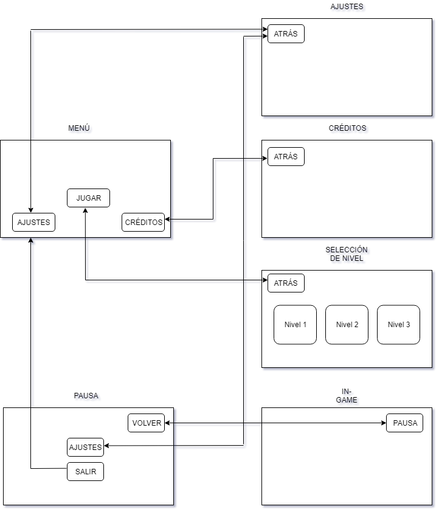

# *Rodillo´s Gaming Studio*

# GAME DESIGN DOCUMENT DE HACKING TOWER DEFENSE

# 1. INTRODUCCIÓN 

<b>Equipo de Desarrollo: </b>

Nuestro equipo de desarrollo, Rodillo´s Games, está compuesto por los siguientes integrantes:
+ Departamento de <b>Programación</b>: Andrés y Manuel.
+ Departamento de <b>Diseño</b>: Javier y Laura.
+ Departamento de <b>Arte</b>: Daniel.

<b>Descripción: </b>
Has creado un programa que de salir a a la luz cambiará la realidad tal y como la conocemos. Viendo lo peligroso que puede llegar a ser decides no compartirlo con el mundo, pero después de todo tu trabajo no te sientes capaz de destruirlo.
Ahora varios hackers tratan de robar los datos de tu programa y solo podrás protegerlo mediante uno de los protocolos que forman parte de él, el protocolo TOWER.
Mientras te enfrentas a los hackers irás descubriendo información sobre ellos y se irá mostrando el verdadero propósito del programa. puede que incluso cambies de opinión sobre su uso.

<b>Objetivo: </b>

<b>Plataformas y Regiones: </b>

# 2. ESTRUCTURA DEL JUEGO
 Pantallas:  

 Mecánicas de juego:  

<b>Controles: </b>

<b>Tipos de torres: </b>

<b>Mejoras para las torres: </b>

<b>Tipos de enemigos: </b>

<b>Puntuación: </b>

# 3. LOGÍSTICA
<b>Herramientas de desarrollo: </b>

<b>Modelo de negocio: </b>

<b>Monetización: </b>

<b>Futuro de Hacking Tower Defense: </b>

<b>Hosting (Alojamiento del proyecto): </b> 

# 4. CONTACTO
<b>Contacto y Redes Sociales: </b>

Facebook: Rodillo´s Gaming
facebook.com/rodillos.gaming.9

Twitter: @RodillosGaming  
twitter.com/RodillosGaming

itch.io: Rodillos Gaming
rodillos-gaming.itch.io/

Youtube: Rodillos Gaming
youtube.com/channel/UCUaR00AHGi0U2Z7mT9jfVfw

email: rodillosgaming@gmail.com
