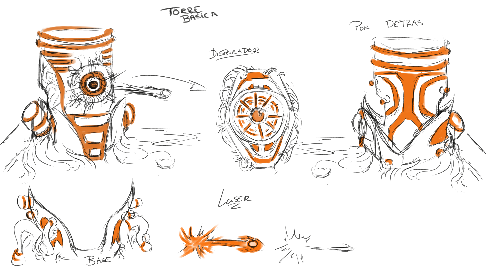
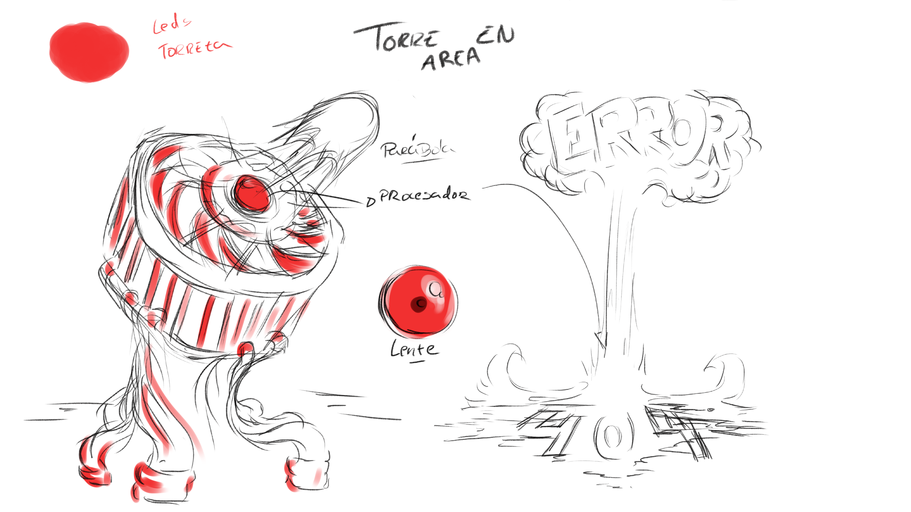
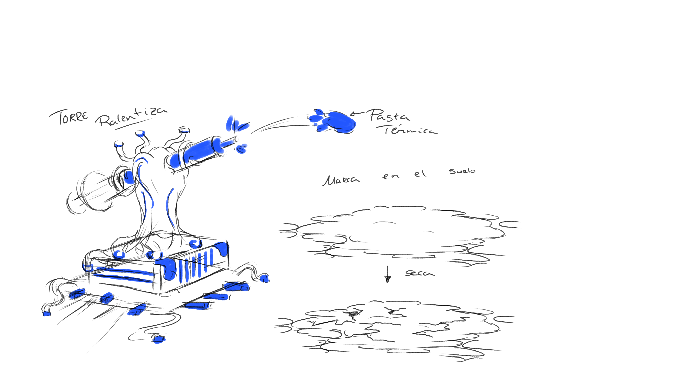
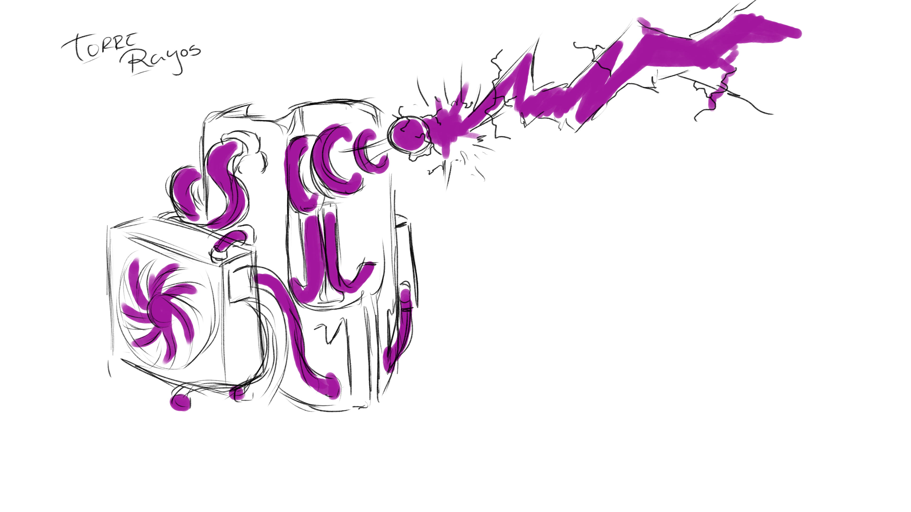

# *Rodillo´s Gaming Studio*

# GAME DESIGN DOCUMENT DE HACKING TOWER DEFENSE

# 1. INTRODUCCIÓN 
## EQUIPO DE DESARROLLO
Nuestro equipo de desarrollo, Rodillo´s Games, está compuesto por los siguientes integrantes:
+ Departamento de <b>Programación</b>: Andrés, Manuel y Javier.
+ Departamento de <b>Diseño</b>: Javier y Laura.
+ Departamento de <b>Modelado y Texturización</b>: Daniel y Laura
+ Departamento de <b>Arte</b>: Daniel.
 

## DESCRIPCIÓN
Has creado un programa que de salir a a la luz cambiará la realidad tal y como la conocemos. Viendo lo peligroso que puede llegar a ser decides no compartirlo con el mundo, pero después de todo tu trabajo no te sientes capaz de destruirlo. 
Ahora varios hackers tratan de robar los datos de tu programa y solo podrás protegerlo mediante uno de los protocolos que forman parte de él, el protocolo TOWER. 
Mientras te enfrentas a los hackers irás descubriendo información sobre ellos y se irá mostrando el verdadero propósito del programa. Puede que incluso cambies de opinión sobre su uso. 
 

## OBJETIVO
El objetivo de *Hacking Tower Defense* es proteger tu nuevo programa para evitar que los hackers accedan a él y te roben datos. Para ello, podrás valerte de una serie de torres en los límites físicos del programa que atacarán a todo agente sospechoso que se acerque por la zona. Dispondrás un terreno finito y tu tarea será gestionar y desplegar las distintas torres con las que cuentes en tu inventario. Pero cuidado, si algún hacker consigue entrar, empezará a robarte información y tu código irá desapareciendo paulatinamente hasta que se adueñen de todo tu programa. <b>¡Debes impedirlo!</b>
 

## PLATAFORMAS Y REGIONES
*Hacking Tower Defense* será lanzado originalmente para dispositivos móviles y ordenadores.
 

# 2. ESTRUCTURA DEL JUEGO
## PANTALLAS
El juego dispone de las siguientes pantallas:
+ Menú principal
+ Ajustes
+ Créditos
+ Selección de nivel
+ Pantalla de juego (*in-game*)
+ Menú de pausa
Desde Ajustes, Créditos, Selección de nivel o el mismo juego, podemos regresar al Menú Principal (perdiendo los últimos avances de la partida en el caso de la Pantalla de Juego), y desde él podremos salir de la aplicación. 
El Menú de Pausa congelará el juego. Desde él, podremos regresar a él en el último punto o salir al Menú Principal con la consecuente pérdida del avance. 
La transición de pantallas es la que se indica en el siguiente diagrama. 

 

## MECÁNICAS DE JUEGO
*Hacking Tower Defense* es un juego estratégico, por lo que las mecánicas son bastantes simples y la experiencia de juego va a depender de la <b>gestión de las unidades en tu inventario<b>. 
Cuando vayas superando mapas, se te irán entregando nuevas y diferentes torres cuya actuación respecto a los enemigos es distinta. Algunos valores mejoran, y otros empeoran. E incluso aparecen algunos nuevos. La responsabilidad del jugador será sopesar los atributos de las torres defensivas y su efectividad contra los distintos tipos de enemigos que podrán ir apareciendo.
 

## CONTROLES
Los controles serán puramente táctiles en el caso de móviles, y clickeando en el caso de ordenadores.  
La transición entre pantallas se conseguirá mediante click en los botones de la interfaz. Asimismo, la colocación de torres en el mapa se realizará igual.
 

## TIPOS DE TORRES

<b>Torre básica</b> 
- Dispara a un solo objetivo de manera intermitente 
- Velocidad de disparo: rápida 
- Coste: bajo 

<b>Torre en área</b> 
- Sus ataques cubren un área en el que dañan a todos los objetivos 
- Velocidad de disparo: lenta 
- Coste: medio 

<b>Torre ralentizadora</b> 
- Sus ataques cubren un área pero no hacen daño sino que reducen la velocidad de los enemigos 
- Velocidad de disparo: media 
- Coste: medio 

<b>Torre de rayos</b> 
- Dispara de manera continua y sus ataques afectan a un solo objetivo 
- Coste: alto 

<b>NOTA:</b> Todas las torres disparan al primer objetivo que entra a su rango hasta que sale del mismo, después seleccionan al siguiente más adelantado dentro de su rango

 

## MEJORAS PARA LAS TORRES
- Mayor velocidad de disparo
- Mayor daño por disparo
- Mayor rango
- Disparo a múltiples objetivos simultáneamente (por ejemplo para la de rayos)
 

## TIPOS DE ENEMIGOS

<b>Enemigo básico</b> 
- Velocidad: lenta 
- Vida: media 
- Coste: 1 

<b>Tanque</b> 
- Velocidad: lenta 
- Vida: alta 
- Coste: 5 

<b>Sanador</b> 
- Velocidad: media 
- Vida: media 
- Restaura vida a otras unidades dentro de su rango de manera periódica 
- Coste: 3 

<b>Corredor</b> 
- Velocidad: rápida 
- Vida: baja 
- Coste: 2 

<b>Volador</b> 
- Velocidad: media 
- Vida: media 
- Al ser volador no le afectan las torres ralentizadoras ni en área 
- Coste: 1 

El coste es el daño que produce un enemigo al llegar a la base que se está defendiendo. En otras palabras los datos que se han robado sobre el total de los datos. 
Cada vez que un enemigo sea derrotado devolverá su coste como moneda.

 

## MAPAS
Los mapas del juego variarán según el nivel en el que estés. Son espacios estáticos y con un recorrido pre-establecido. 
Pero cada partida será diferente, pues las combinaciones de enemigos serán aleatorias, consiguiendo que el jugador deba emplear diferentes estrategias según las circunstancias.
 

## PUNTUACIÓN
 

# 3. LOGÍSTICA
## HERRAMIENTAS DE DESARROLLO
Se trata de un videojuego en 3D, por lo que será desarrollado con el motor gráfico *Unity 3D* respaldado con el IDE *Microsoft Visual Studio 2019* para codificación. 
Para la etapa de Concept Art, se utilizará *Adobe Photoshop CC 2018*.
En Modelado se usará *ZBrush* y en Texturización *Substance*.
 

## MONETIZACIÓN

<b>Formato episódico:  cada episodio tiene un conjunto de niveles y personajes (hackers) sobre los que vas descubriendo información. Según progresa la historia se irá revelando más información sobre el programa.
Los episodios se irán lanzando según se vayan desarrollando con un precio preestablecido para todos. 

<b>Booklet de concept:</b> por un pequeño extra puedes obtener un libro con el arte original del juego y comentarios sobre los diseños, así como contenido extra que amplía el del juego. 

 

## FUTURO DE HACKING TOWER DEFENSE

<b>DLC Modo multijugador:</b> en este modo el objetivo será aguantar más tiempo que el rival, de manera que consigas robar todos su datos sin que él robe los tuyos. 

<b>DLC Editor de escenarios:</b> en este modo puedes crear tus propios escenarios, y configurar los enemigos para compartirlos con otros jugadores o jugarlos tú mismo. 

 

## HOSTING
El hosting del proyecto se hará en <b>*Git*</b>, del que podrán nutrirse *Facebook* e *itch.io*
 

# 4. CONTACTO
## MAIL, PLATAFORMAS INDIES Y REDES SOCIALES

+ Facebook: Rodillo´s Gaming 
facebook.com/rodillos.gaming.9

+ Twitter: @RodillosGaming 
twitter.com/RodillosGaming

+ itch.io: Rodillos Gaming 
rodillos-gaming.itch.io/

+ Youtube: Rodillos Gaming 
youtube.com/channel/UCUaR00AHGi0U2Z7mT9jfVfw

+ email: rodillosgaming@gmail.com
 

<b>¡GRACIAS POR JUGAR! :)</b>
